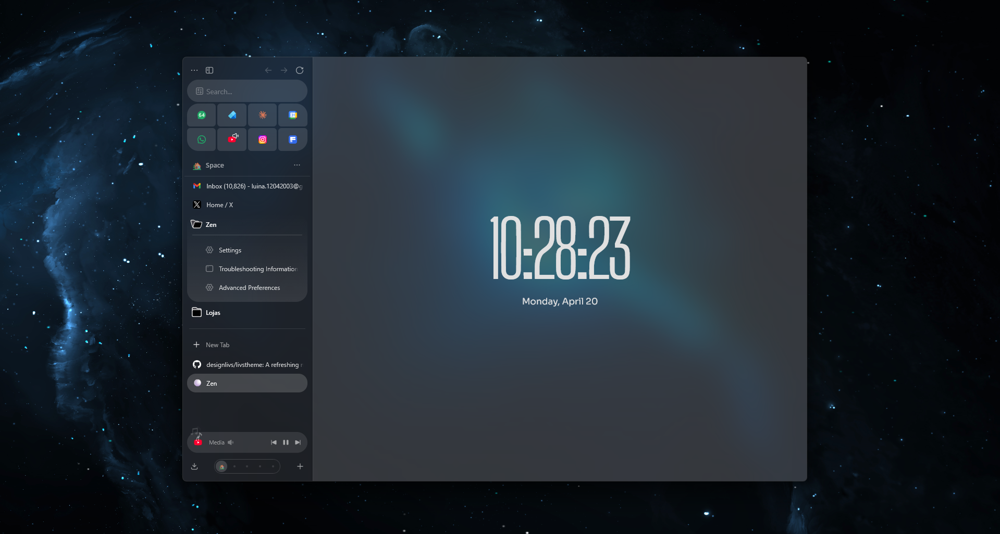

# Livs Theme

A clean, modern userChrome theme for [Zen Browser](https://zen-browser.app) that refines the default UI with a sharper, more intentional aesthetic.

---

## Features

- **Workspace switcher** — redesigned as a compact sliding toggle with smooth animated transitions between workspaces
- **Sidebar styling** — refined spacing and visual treatment for a cleaner, less cluttered feel
- **Tab bar tweaks** — improved tab proportions and subtle visual polish
- **Typography & spacing** — tightened up across the UI for a more cohesive, modern look

---

## Installation

### Via Sine (recommended)

1. Open Zen Browser settings and navigate to the **Sine** tab
2. Search for **Livs Theme** in the marketplace
3. Click install — done

### Manual

1. Copy the contents of `userChrome.css` into your profile's `chrome/userChrome.css` file
2. If the file doesn't exist yet, create it
3. Restart Zen Browser

To find your profile folder: go to `about:profiles` in the address bar and open the **Root Directory** of your active profile.

---

Bonjourr Instructions to reproduce screenshot soon...

---

## Compatibility

- ✅ Zen Browser
- Tested on Windows — feedback welcome for macOS/Linux

---

## License

Feel free to fork and adapt for personal use. Credit appreciated but not required.

---

Made by [designlivs](https://github.com/designlivs)